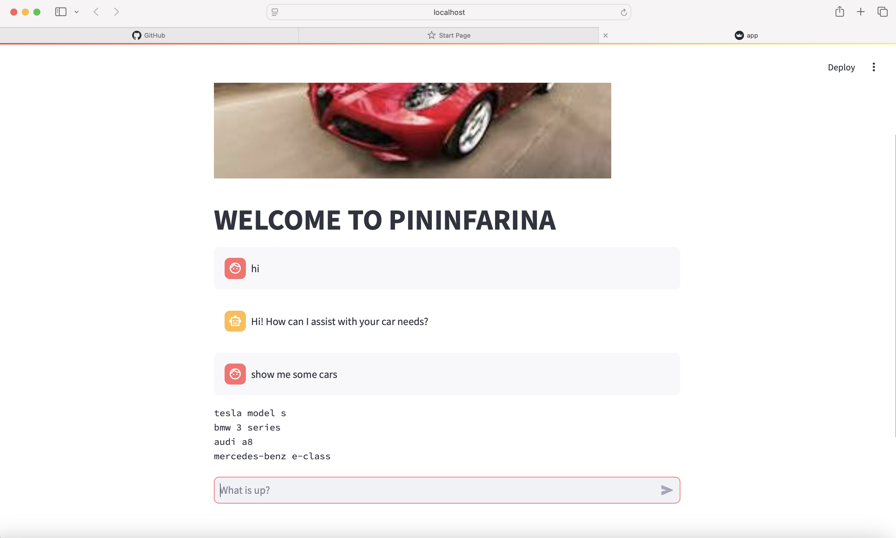
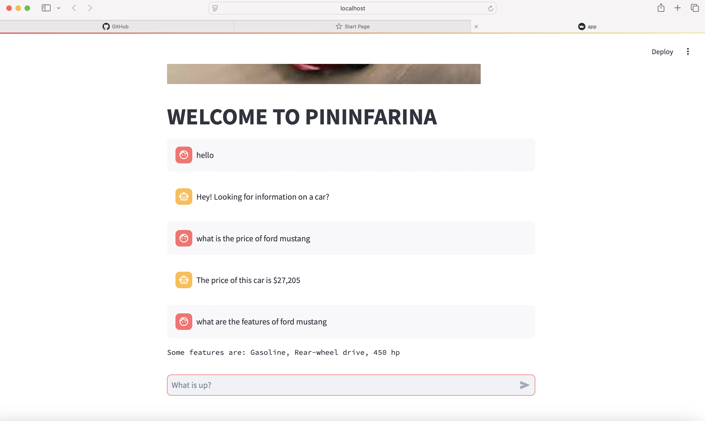

# AutoBot -NLP Based Chatbot

This project is a rule-based chatbot designed to interact with users regarding car-related queries. The chatbot is built using Natural Language Processing (NLP) techniques and is capable of recognizing the intent of the user’s query. Once the intent is classified, the bot retrieves relevant information about specific car models from a pre-built dataset stored in a JSON file.

# Images

# Features

- **Intent Classification**: The chatbot classifies user queries based on their intent, allowing for more structured and accurate responses.
- **Car Model Recognition**: The bot can recognize the name of a car in the user's query and fetch specific details about the car.
- **Prebuilt Responses**: The bot retrieves pre-defined responses based on the recognized intent, making the interaction quick and efficient.
- **JSON File Integration**: Car details, such as model specifications, features, and prices, are stored in a JSON file for easy access and scalability.

# How It Works

1. **User Query**: The user inputs a query related to a car.
2. **Intent Classification**: The chatbot processes the query to classify its intent (e.g., information request, comparison, features, etc.).
3. **Car Name Recognition**: The chatbot identifies the name of the car mentioned in the query.
4. **Data Retrieval**: Once the intent and car name are recognized, the chatbot searches for the relevant information in the JSON file and returns a prebuilt response.
   
# Technologies Used

- **Python**: The core programming language for building the chatbot.
- **Natural Language Processing (NLP)**: Techniques such as tokenization, intent classification, and named entity recognition (NER) are used.
- **JSON**: Data about different car models is stored in a JSON file to facilitate easy access.
- **Libraries/Tools**:
  - nltk (Natural Language Toolkit) for NLP tasks.
  - scikit-learn for machine learning algorithms (if you are using any classifier).
  - json for parsing the car details JSON file.
  
